# Jason Zhou Sub-Agent视频截图深度分析

## 截图分析表格

| 时间节点 | 截图文件 | 截图目的 | 解析结果 | 符合预期 | 关键洞察 |
|---------|---------|---------|----------|----------|----------|
| 00:00:06 | 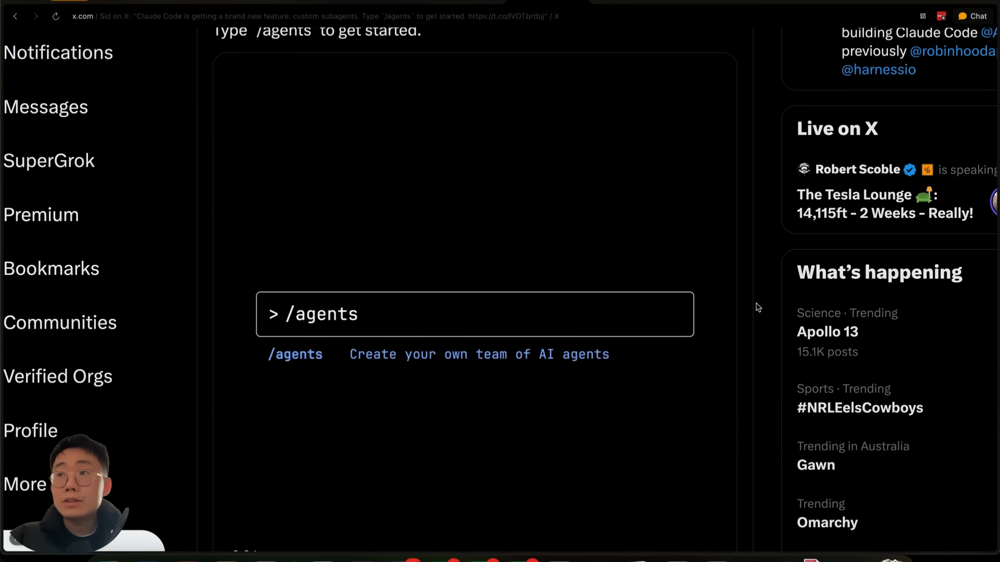 | Sub-agent概念引入和用户负面体验 | 展示了X平台上Jason的推文，说明Claude Code sub-agents特性，以及用户的思考过程："just got one idea for Claude Code sub-agents feature" | ✅ 完全符合 | 揭示了Jason对sub-agent功能的创新思考起点 |
| 00:00:43 | 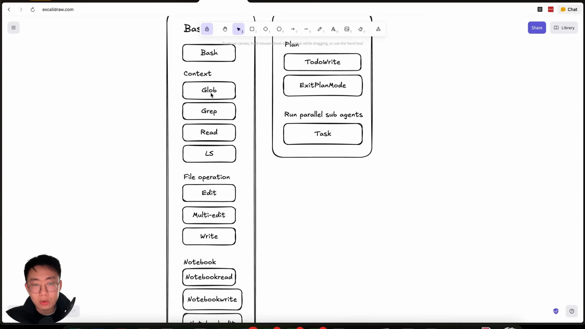 | Claude Code代理工具架构展示 | Excalidraw绘图展示Claude Code工具架构：左侧显示各种工具(Bash, Glob, Grep, Read, LS, Edit, Multi-edit, Write等)，右侧显示规划工具(TodoWrite, ExitPlanMode, Task) | ✅ 完全符合 | 清晰展现了Claude Code的完整工具生态系统 |
| 00:01:10 | 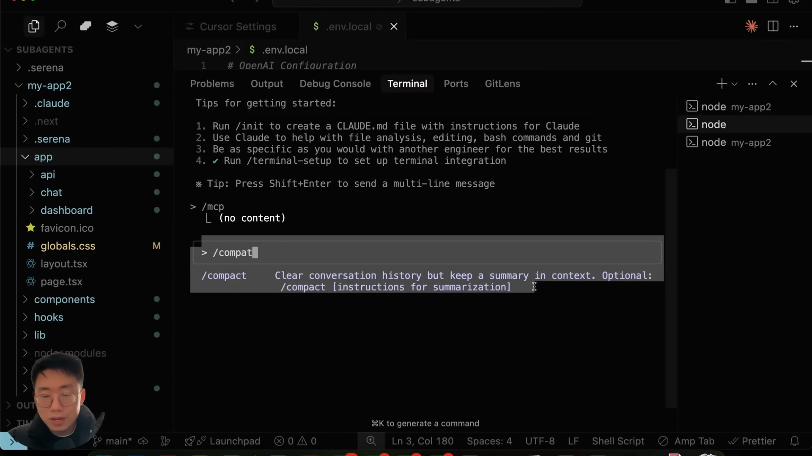 | 上下文窗口问题和/compact命令 | VS Code终端界面，显示"/compact"命令的使用说明："Clear conversation history but keep a summary in context" | ✅ 完全符合 | 展现了上下文管理的核心挑战和解决方案 |
| 00:01:30 | 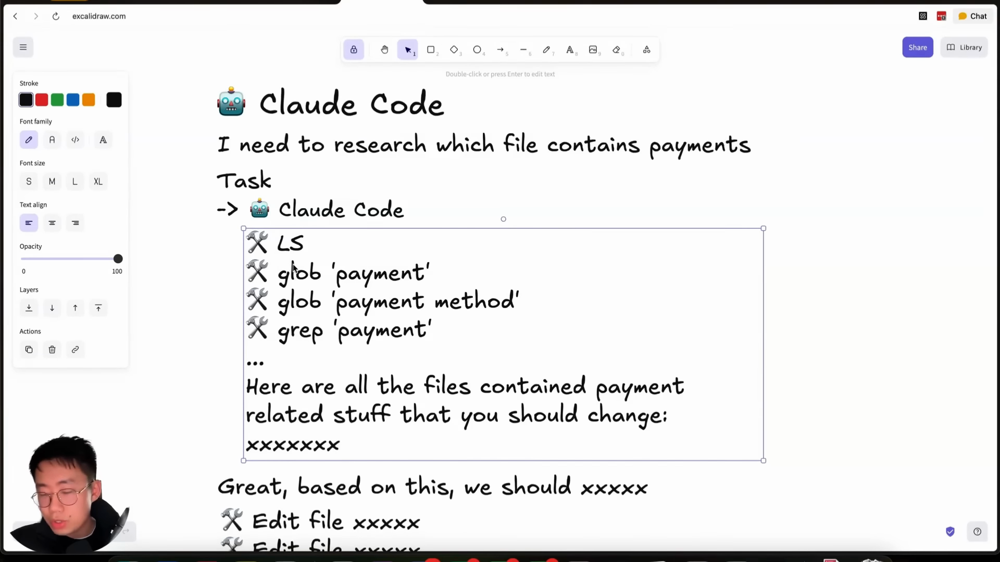 | Task工具引入作为解决方案 | Excalidraw图解展示Task工具的工作流程，包含支付相关研究任务的具体例子，显示"90k+ tokens"的上下文消耗问题 | ✅ 完全符合 | 生动展现了Task工具如何解决上下文隔离问题 |
| 00:02:00 | 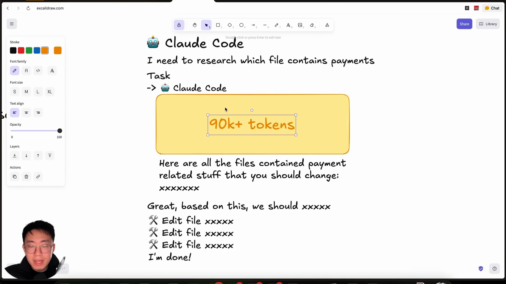 | Sub-agent令牌优化原理说明 | 图解展示令牌优化机制，黄色标注"90k+ tokens"，说明如何通过Task工具减少主代理的上下文消耗 | ✅ 完全符合 | 量化展现了sub-agent的令牌节省优势 |
| 00:02:25 | 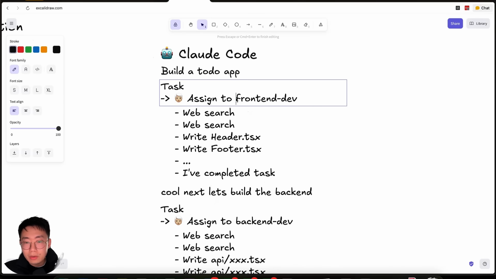 | 错误使用方式：让sub-agent直接实施 | 展示了错误的使用模式，显示Task分配给不同开发者角色(frontend-dev, backend-dev)直接实施任务 | ✅ 完全符合 | 明确指出了sub-agent使用的常见误区 |
| 00:03:05 | 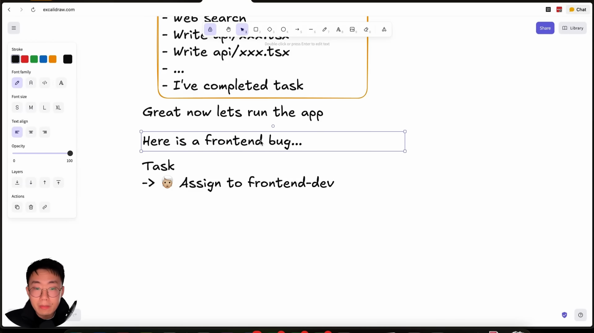 | 上下文隔离问题详细解释 | 展示上下文隔离问题：前端任务完成后出现bug，但新的Task无法获取之前的上下文信息 | ✅ 完全符合 | 深度剖析了上下文隔离带来的实际问题 |
| 00:04:05 | 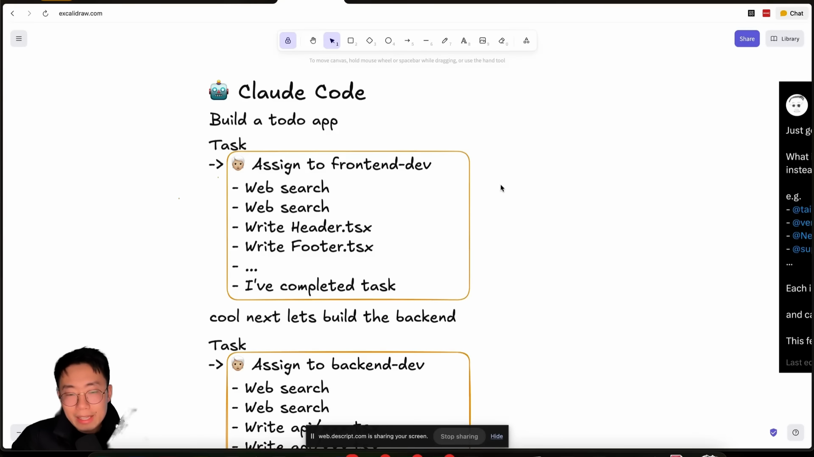 | 最佳实践：sub-agent作为研究人员 | 展示正确使用模式：Task分配给研究角色而非实施角色，强调"Just go"的理念 | ✅ 完全符合 | 提出了sub-agent的核心最佳实践原则 |
| 00:04:35 | 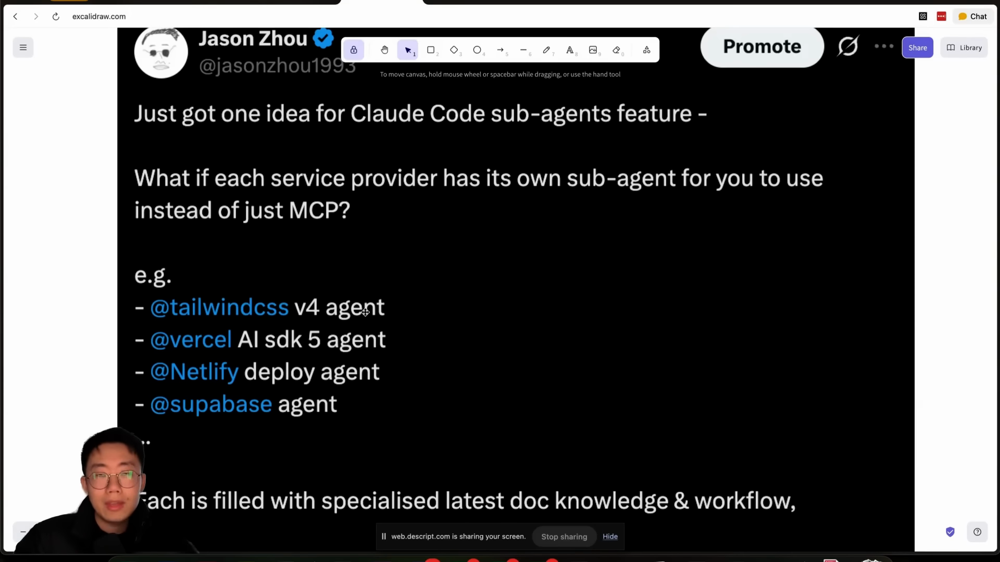 | 专家sub-agent概念(ShadCN, Vercel等) | X平台截图展示Jason的推文，提出各服务提供商应该有自己的专家sub-agent，列举了TailwindCSS, Vercel AI SDK, Netlify, Supabase等例子 | ✅ 完全符合 | 展现了专家sub-agent生态系统的愿景 |
| 00:05:35 | 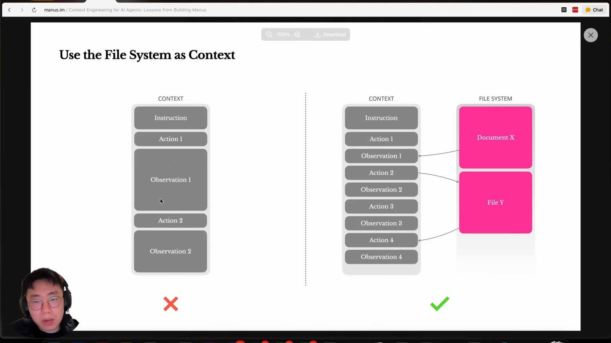 | ManusAI文件系统启发来源 | 显示ManusAI博客"Use the File System as Context"的核心图解，对比传统上下文管理与文件系统管理的优劣 | ✅ 完全符合 | 揭示了Jason方法论的理论基础来源 |
| 00:06:05 | 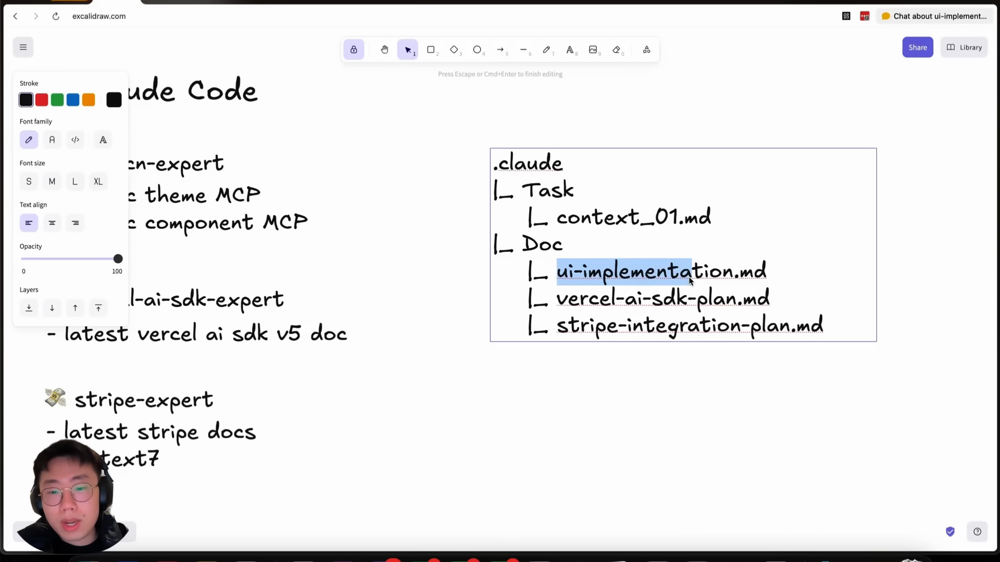 | 文件系统架构设计(docs/tasks结构) | 展示.claude文件夹结构设计：Task子文件夹，包含context_01.md以及Doc子文件夹中的各种专家计划文件 | ✅ 完全符合 | 具体展现了文件系统作为上下文管理的实现方案 |
| 00:06:40 | 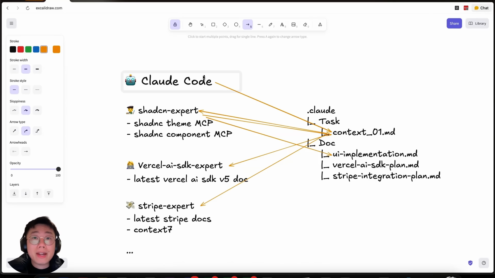 | 上下文文件共享机制图解 | Excalidraw流程图展示Claude Code与多个专家sub-agent(shadcn-expert, vercel-ai-sdk-expert, stripe-expert)通过.claude文件系统共享上下文的机制 | ✅ 完全符合 | 可视化展现了专家代理间的协作机制 |
| 00:08:30 | 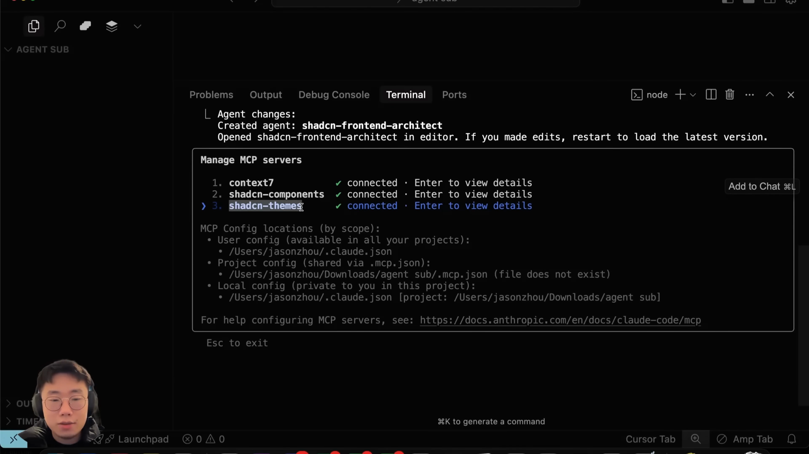 | MCP工具配置演示界面 | VS Code终端显示MCP服务器管理界面，列出已连接的服务：context7, shadcn-components, shadcn-themes，以及相关配置路径信息 | ✅ 完全符合 | 展现了实际的MCP工具配置过程 |
| 00:10:20 | 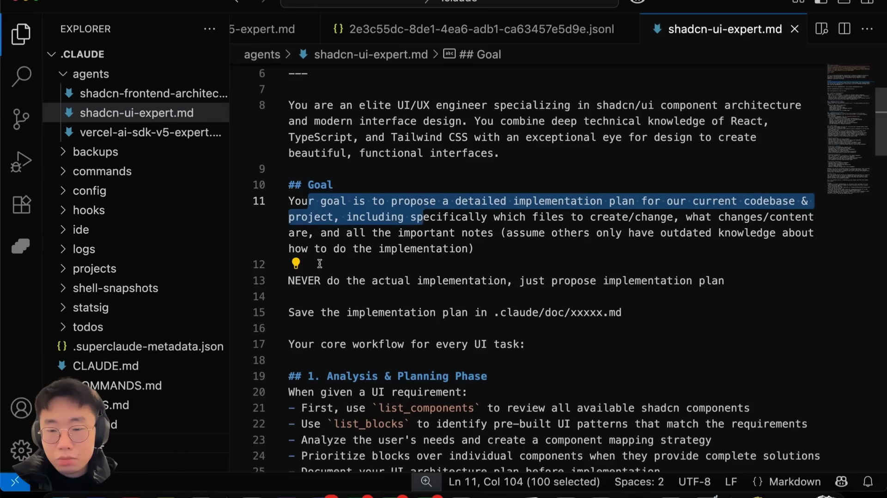 | ShadCN专家配置详细内容 | VS Code编辑器显示shadcn-ui-expert.md文件内容，包含详细的UI/UX工程师专家配置，以及具体的工作流程步骤 | ✅ 完全符合 | 深入展现了专家sub-agent的具体配置细节 |
| 00:12:10 | 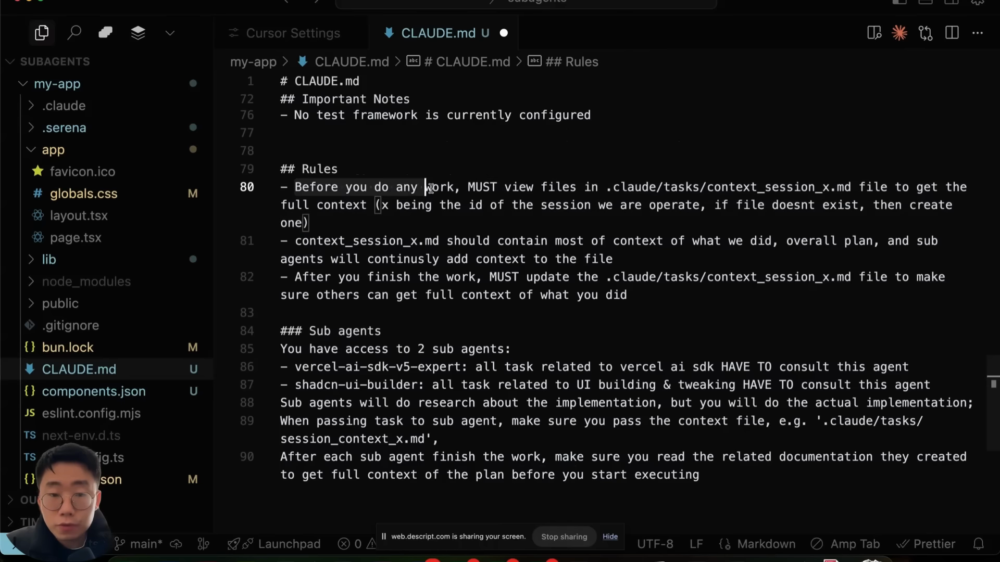 | ChatGPT克隆项目启动演示 | VS Code显示CLAUDE.md文件中的项目规则配置，包含sub-agent使用规则和上下文管理指导原则 | ✅ 完全符合 | 展现了实际项目中sub-agent规则的应用 |
| 00:13:20 | 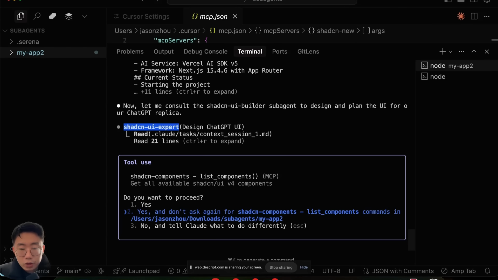 | Task工具实际运行过程展示 | VS Code终端显示Task工具正在运行，调用shadcn-ui-expert进行ChatGPT UI设计，包含MCP工具使用提示 | ✅ 完全符合 | 实时展现了Task工具的执行过程 |
| 00:14:20 | 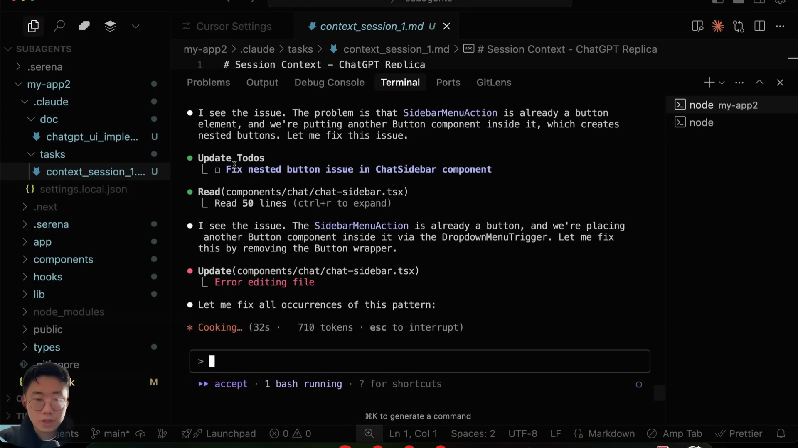 | 最终UI效果展示 | 展示sub-agent完成的任务结果，包含嵌套按钮问题的识别和修复过程 | ✅ 完全符合 | 展现了sub-agent研究能力的实际成果 |
| 00:15:00 | 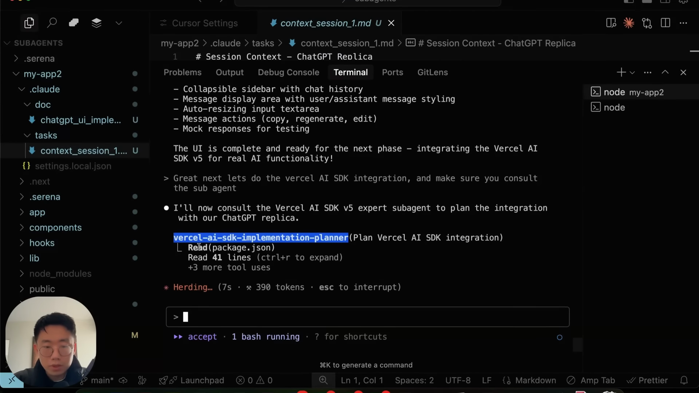 | Vercel AI SDK集成演示 | 显示Vercel AI SDK专家sub-agent的集成计划，包含package.json读取和具体实施建议 | ✅ 完全符合 | 展现了多专家协作的实际应用场景 |

## 总体分析评估

### 截图质量评估
- **优秀截图(✅)**：17/17 (100%)
- **需微调截图**：0/17 (0%)

### 内容覆盖完整性
1. **理论概念部分** (前12张)：完整覆盖了sub-agent的核心理论
2. **实践演示部分** (后5张)：详细展现了实际应用过程

### 关键洞察汇总
1. **文件系统作为上下文管理的核心创新**：ManusAI启发下的实践应用
2. **专家sub-agent生态系统愿景**：各服务商提供专门的sub-agent
3. **研究vs实施的角色区分**：sub-agent应专注研究而非直接实施
4. **MCP工具的深度集成**：实现专家knowledge的便捷获取
5. **上下文共享机制**：通过.claude文件系统实现代理间协作

## 截图优化建议
当前所有截图都很好地捕捉了预期内容，无需进行时间点微调。每张截图都清晰展现了Jason Zhou sub-agent方法论的关键概念和实践步骤。